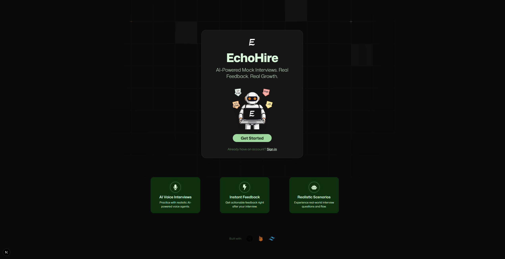
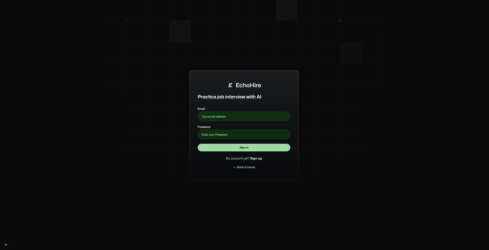
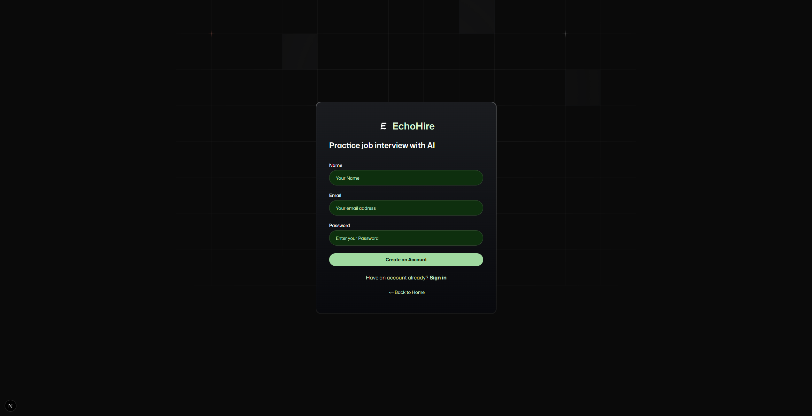
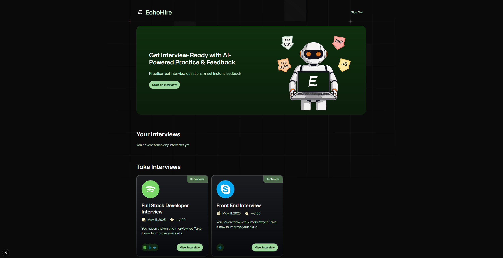
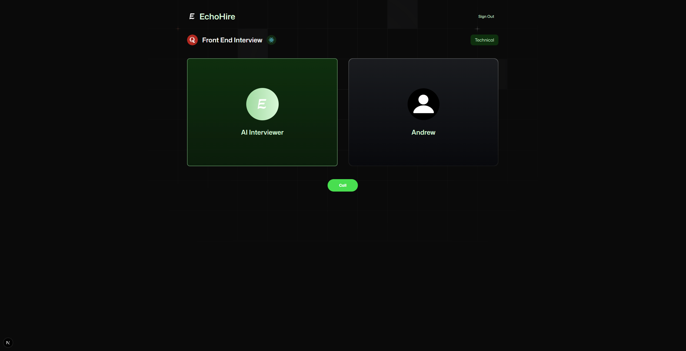

# 🎙️ EchoHire – AI-Powered Mock Interview Platform

**EchoHire** is a voice-driven mock interview platform built with Next.js, Firebase, and Vapi AI. It simulates realistic job interviews and provides structured feedback powered by Google Gemini. Designed as a personal project to explore voice interfaces and full-stack development.

---

## ⚙️ Tech Stack

- **Next.js (App Router)** – frontend & backend  
- **Tailwind CSS** – styling  
- **Firebase** – authentication & Firestore  
- **Vapi AI** – voice-powered interview agent  
- **Google Gemini API** – AI-generated interview feedback  
- **Zod** – schema validation  
- **shadcn/ui** – component library  

---

## 🔋 Features

- Voice-based mock interviews with AI  
- Instant, structured feedback after completion  
- Tracks past interviews and performance  
- Role-specific technical and behavioral questions  
- Clean and responsive UI  
- Firebase-powered auth flow  

---

## 🚀 Getting Started

### 1. Clone the repo

```bash
git clone https://github.com/AndrewFesenko/ai_mock_interview.git
cd ai_mock_interview
```

### 2. Install dependencies

```bash
npm install
```

### 3. Set up environment variables

Create a `.env.local` file in the root of the project and add:

```env
# Firebase Admin SDK
FIREBASE_PROJECT_ID=
FIREBASE_CLIENT_EMAIL=
FIREBASE_PRIVATE_KEY=

# Firebase Client SDK
NEXT_PUBLIC_FIREBASE_API_KEY=
NEXT_PUBLIC_FIREBASE_AUTH_DOMAIN=
NEXT_PUBLIC_FIREBASE_PROJECT_ID=
NEXT_PUBLIC_FIREBASE_STORAGE_BUCKET=
NEXT_PUBLIC_FIREBASE_MESSAGING_SENDER_ID=
NEXT_PUBLIC_FIREBASE_APP_ID=

# Vapi AI
NEXT_PUBLIC_VAPI_WEB_TOKEN=
NEXT_PUBLIC_VAPI_WORKFLOW_ID=

# Google AI
GOOGLE_GENERATIVE_AI_API_KEY=
```

### 4. Run locally

```bash
npm run dev
```

Open [http://localhost:3000](http://localhost:3000) in your browser.

---

## 📸 Screenshots

### Landing


### Sign In


### Sign Up


### Dashboard


### Interview


### Feedback


---

## 🙏 Credits

This project was inspired by [Adrian Hajdin](https://github.com/adrianhajdin).

---
